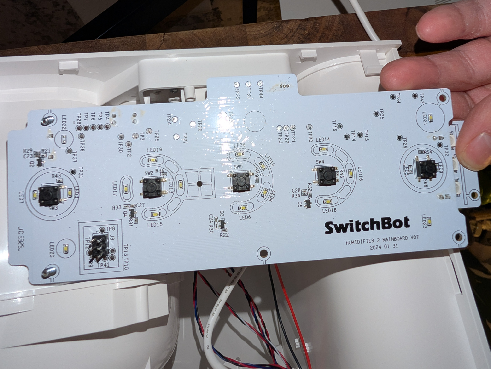
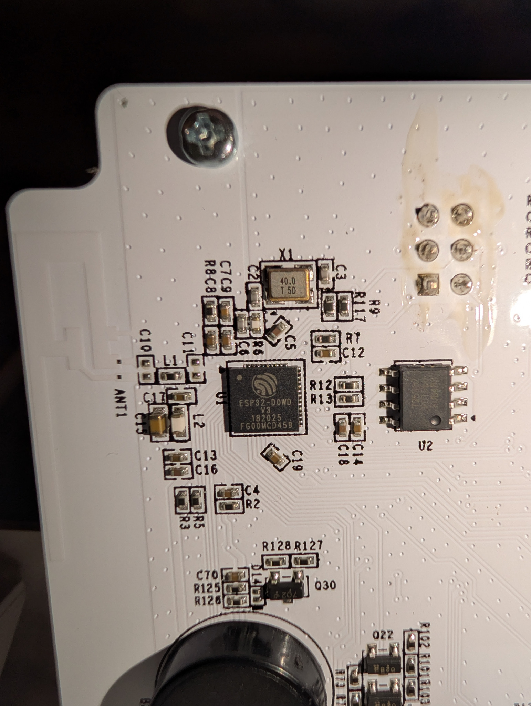

# SwitchBot Evaporative Humidifier 2 (W3902310) — ESPHome

A reverse-engineered ESPHome replacement for the original firmware on the
SwitchBot Evaporative Humidifier 2, model **W3902310**, with the
**HUMIDIFIER 2 MAINBOARD V07**.

The core humidification path is working on real hardware: the blower spins at
the recovered command frequencies, the panel reports empty/low water, and the
circulation system wets the filter after the stock-derived eight-second startup
delay. To the best of our knowledge, this is the first publicly documented
working ESPHome port for this model. That does not prove that no private or
unindexed port exists.

> [!WARNING]
> This is experimental firmware for a mains-powered appliance containing water.
> Flashing removes the original SwitchBot firmware and may defeat behavior that
> has not yet been reconstructed. Disconnect mains before opening the appliance
> or changing UART wiring. Use 3.3 V UART logic only—never 5 V—and do not work
> on an energized, exposed board unless you are qualified to do so. Read
> [SAFETY.md](SAFETY.md) before proceeding.



## Project status

This is a functional replacement for the core humidifier, not yet a
bit-for-bit or feature-complete clone of the stock firmware.

| Area | Status |
|---|---|
| Four blower levels | Implemented; 125 / 250 / 400 / 550 Hz |
| Blower enable | Implemented on GPIO2 |
| Blower tachometer | Implemented on GPIO34 with startup fail-safe |
| Water-level decoding | Implemented from the five-byte panel key scan |
| Water circulation | Working on the tested V07 unit |
| Wet startup delay | Implemented; approximately 8 seconds |
| Automatic filter drying | Implemented and observed to start |
| Home Assistant control | Implemented through native ESPHome API |
| Target, Auto, and Sleep modes | Implemented using optional HA room sensors |
| Filter-use reminder | Implemented at 240 wet-running hours |
| Front-panel buttons | Raw scan available; individual buttons not mapped |
| Segment display/icons | Not mapped or driven |
| Stock LED animations and beep patterns | Not replicated |
| Child lock | Not implemented |
| S10/auto-refill accessory | Deliberately disabled |
| SwitchBot app, cloud, BLE, and Matter | Replaced by ESPHome/HA |

The included build is runtime revision `2026.07.23-r3`. It was configuration
validated, compiled, and linked with **ESPHome 2026.7.1** and
**ESP-IDF 5.5.5**. See [VALIDATION.md](docs/VALIDATION.md) for the compile
result and real-device evidence.

### An important filter-dry caveat

The current configuration uses a **55-minute** dry cycle. SwitchBot's current
support article describes a **70-minute** countdown at 20 °C. The exact
duration used by the recovered `V0_7` firmware has not yet been confirmed by a
complete timed hardware run, so this project does not claim exact parity here.
Change `filter_dry_duration` in the YAML if you want 70 minutes.

## Hardware

- **Model**: SwitchBot Evaporative Humidifier 2 (W3902310)
- **Board**: HUMIDIFIER 2 MAINBOARD V07 (dated 2024 01 31)
- **Chip**: ESP32-D0WD V3 (revision v3.1), QFN-48, 40 MHz crystal
- **MAC of the tested unit**: `88:57:21:44:42:0C`
- **Flash**: 4 MB SPI, DIO mode, 40 MHz
- **Programming header**: J3, 2×3 pin header; pinout confirmed below
- **Security state of the tested unit**: no Secure Boot or flash encryption;
  relevant eFuses were open
- **Original firmware**: ESP-IDF v5.0.2, project `WoHumi2`, developer string
  `zkk`

The MAC address is unique to the tested appliance. It is included only as
provenance and must not be copied into another unit.

### J3 header pinout

The pinout was confirmed by voltage measurement, boot-mode testing, serial
logs, flash backup, and successful UART installation.

```text
Front of board, component side

        left column          right column
        ┌───────────────┐
        │ TP8   EN      │ TP13  GPIO0
        │ TP12  ESP RX  │ TP10  ESP TX
        │ TP9   3V3     │ TP41  GND
        └───────────────┘
```

Confirmed UART wiring:

```text
USB-UART adapter           J3 test point
TXD                    ->  TP12  (ESP32 RX)
RXD                    ->  TP10  (ESP32 TX)
GND                    ->  TP41  (GND)
RTS                    ->  TP13  (GPIO0; confirmed test setup)
```

TP8 is ESP32 `EN`. TP9 exposes 3.3 V, but it is **not part of the confirmed
adapter wiring above**. Do not connect an adapter's 5 V pin. Do not assume a
small USB-UART adapter can power the complete mainboard through TP9.



The full recovered GPIO map and stock partition table are in
[RE_EVIDENCE.md](RE_EVIDENCE.md). Additional board notes are in
[HARDWARE.md](docs/HARDWARE.md).

## Step-by-step flashing guide

### 1. Read the safety and recovery notes

Read [SAFETY.md](SAFETY.md), then make sure you can enter the ESP32 ROM
bootloader and create a full stock backup **before writing anything**. Keep that
backup private: it can contain device-specific NVS, certificates, calibration,
and identifiers.

The repository intentionally contains no stock firmware and no prebuilt
ESPHome binary.

### 2. Prepare the software

Use ESPHome 2026.7.0 or newer. The exact tested version is 2026.7.1.

With an existing ESPHome Dashboard, copy this entire repository into a
configuration directory. For a command-line installation:

```sh
python -m venv .venv
. .venv/bin/activate
python -m pip install "esphome==2026.7.1"
```

Windows PowerShell activates the environment with:

```powershell
.\.venv\Scripts\Activate.ps1
```

### 3. Attach the 3.3 V UART

1. Unplug the humidifier from mains.
2. Open it only as far as necessary to reach J3.
3. Confirm the header orientation against the board labels and photo.
4. Connect adapter TXD, RXD, and GND using the table above.
5. Connect RTS to TP13/GPIO0 only if your adapter matches the confirmed test
   setup. Adapter control-line polarity varies.
6. Secure every lead so it cannot slip or short adjacent pads.

Powering the board during serial access is installation-specific and was not
fully characterized by this project. Do not improvise around exposed mains.
Use an isolated, current-limited low-voltage setup verified by a competent
technician, or have a qualified technician perform the powered steps.

### 4. Enter download mode

The ESP32 ROM loader starts when GPIO0 is low during reset.

For manual entry:

1. Hold TP13/GPIO0 low.
2. Briefly pull TP8/EN low, then release EN.
3. Release GPIO0 after reset.

If RTS control works with your adapter, `esptool` may handle GPIO0 while you
manually pulse EN. A conventional two-control-line auto-reset circuit was not
confirmed on J3, so this guide does not assume one.

Test communication without writing:

```sh
esptool.py --chip esp32 --port /dev/ttyUSB0 flash_id
```

Replace `/dev/ttyUSB0` with your port, such as `COM5` on Windows. With esptool
v5, the executable may be named `esptool` and command names use hyphens:

```sh
esptool --chip esp32 --port /dev/ttyUSB0 flash-id
```

### 5. Back up all 4 MB of stock flash

For the esptool v4.x bundled with the tested ESPHome toolchain:

```sh
esptool.py --chip esp32 --port /dev/ttyUSB0 --baud 460800 \
  read_flash 0x000000 0x400000 wohumi2-backup-a.bin

esptool.py --chip esp32 --port /dev/ttyUSB0 --baud 460800 \
  read_flash 0x000000 0x400000 wohumi2-backup-b.bin
```

For esptool v5:

```sh
esptool --chip esp32 --port /dev/ttyUSB0 --baud 460800 \
  read-flash 0x000000 0x400000 wohumi2-backup-a.bin
```

Verify that each file is exactly 4,194,304 bytes and that two independent reads
match:

```sh
wc -c wohumi2-backup-a.bin wohumi2-backup-b.bin
sha256sum wohumi2-backup-a.bin wohumi2-backup-b.bin
cmp wohumi2-backup-a.bin wohumi2-backup-b.bin
```

On Windows, use `Get-FileHash` and check the file length in Properties. Store at
least one copy off the machine. Never commit or publish the backup.

### 6. Configure secrets and optional room sensors

Copy the example:

```sh
cp secrets.example.yaml secrets.yaml
```

Set real Wi-Fi, fallback AP, API encryption, and OTA values in `secrets.yaml`.
One way to generate an API encryption key is:

```sh
openssl rand -base64 32
```

At the top of `switchbot-humidifier.yaml`, change these substitutions to Home
Assistant humidity and temperature entities if available:

```yaml
substitutions:
  humidity_sensor: sensor.bedroom_humidity
  temperature_sensor: sensor.bedroom_temperature
```

The appliance has no onboard room temperature/humidity sensor. Manual
Quiet/Low/Medium/High operation and hardware interlocks do not require the
paired entities. Target, Auto, Sleep, and the 70% RH cutoff do.

### 7. Validate and compile

From the repository directory:

```sh
esphome config switchbot-humidifier.yaml
esphome compile switchbot-humidifier.yaml
```

Do not flash if either command reports an error. Warnings about unavailable
Home Assistant entity states at compile time are not the same as YAML or C++
build failures.

### 8. Perform the first serial install

Re-enter download mode if needed, then let ESPHome compile and upload:

```sh
esphome run switchbot-humidifier.yaml --device /dev/ttyUSB0
```

Alternatively, if ESPHome Dashboard gives you a merged
`firmware.factory.bin`, it is written at offset `0x0`:

```sh
esptool.py --chip esp32 --port /dev/ttyUSB0 --baud 460800 \
  write_flash --flash_mode dio --flash_freq 40m --flash_size 4MB \
  0x0 firmware.factory.bin
```

Use the factory/merged binary only for this command. Do not write a single
application-only binary at `0x0`.

After upload, release GPIO0, reset with TP8/EN, and watch logs:

```sh
esphome logs switchbot-humidifier.yaml --device /dev/ttyUSB0
```

### 9. Commission it with wet hardware disarmed

`Wet System Armed` defaults to **off** on a fresh install. Leave it off and
follow [COMMISSIONING.md](docs/COMMISSIONING.md):

1. Confirm `Water Level` is `Empty` with no water.
2. Start at speed 1 and verify the blower physically spins.
3. Confirm a non-zero tachometer value and the requested signal frequency.
4. Test all four blower levels.
5. Fill the tank and confirm the water state changes.
6. Only then arm the wet system and run a supervised speed-2 test.
7. Confirm circulation begins after roughly eight seconds and no water leaks.

Press **Stop All Hardware** immediately if the buzzer becomes continuous, the
blower does not spin, circulation starts with an empty tank, there is a leak,
or anything behaves abnormally.

### 10. Use OTA for later updates

Once the first install is healthy and connected to Wi-Fi:

```sh
esphome run switchbot-humidifier.yaml
```

ESPHome will offer the network device. Keep the UART recovery path and stock
backup available.

### Restoring the original firmware

Enter download mode and write the complete, verified 4 MB backup at offset
zero:

```sh
esptool.py --chip esp32 --port /dev/ttyUSB0 --baud 460800 \
  write_flash 0x000000 wohumi2-backup-a.bin
```

Reset with GPIO0 released. A full-device backup is required; this repository
cannot supply SwitchBot firmware or restore device-specific data for you.

## How the port works

The custom component is a four-level `FloatOutput` used by ESPHome's speed-fan
platform. It owns the low-level pins and enforces the critical sequence:

```text
fan request
    │
    ├─ set GPIO17 command frequency and 50% duty
    ├─ assert GPIO2 blower enable
    ├─ wait for tachometer feedback
    ├─ wait until 8-second startup delay has elapsed
    └─ if armed and water is not Empty, enable GPIO12 + GPIO22 together

fan off after a wet run
    │
    ├─ disable GPIO12 + GPIO22 immediately
    └─ keep blower at speed 2 for the configured filter-dry interval
```

This explains why the physical fan may continue after the Home Assistant fan
entity is turned off: the separate `Filter Dry Running` state is active. Use
**Stop All Hardware** to abort it.

## Fail-closed behavior

- Wet outputs start disarmed on first installation.
- GPIO12 and GPIO22 cannot energize until water scan, tach feedback, startup
  delay, and the user arm switch all allow it.
- An empty-water result disables both wet outputs.
- A missing/low tach result after the startup window disables blower and wet
  outputs.
- GPIO16 is treated as a piezo buzzer, defaults off, and is clamped to a
  20–500 ms one-shot.
- GPIO14/GPIO25 and the optional S10 auto-refill protocol remain inactive.
- Shutdown and **Stop All Hardware** force known power/control outputs off.

These additions are conservative ESPHome safeguards. They are not evidence
that every safety behavior in the proprietary firmware has been reproduced.

## Repository layout

```text
.
├── components/switchbot_humidifier/  # ESPHome Python schema and C++ driver
├── docs/
│   ├── COMMISSIONING.md              # Supervised first-run checklist
│   ├── FLASHING.md                   # Detailed backup/flash/recovery notes
│   ├── HARDWARE.md                   # Board, J3, and recovered GPIO map
│   ├── STOCK_PARITY.md               # Implemented vs missing stock behavior
│   ├── VALIDATION.md                 # Build and real-device results
│   └── images/                       # Board photographs
├── RE_EVIDENCE.md                    # Binary reverse-engineering evidence
├── SAFETY.md                         # Electrical and water safety
├── secrets.example.yaml              # Placeholder credentials only
└── switchbot-humidifier.yaml         # Complete example configuration
```

## Documentation

- [Detailed flashing and recovery](docs/FLASHING.md)
- [Hardware and J3 pinout](docs/HARDWARE.md)
- [First-run commissioning](docs/COMMISSIONING.md)
- [Stock-parity matrix](docs/STOCK_PARITY.md)
- [Build and hardware validation](docs/VALIDATION.md)
- [Reverse-engineering evidence](RE_EVIDENCE.md)
- [Contribution guide](CONTRIBUTING.md)
- [Changelog](CHANGELOG.md)

## References

- [SwitchBot Evaporative Humidifier product page](https://www.switch-bot.com/products/switchbot-evaporative-humidifier)
- [SwitchBot filter-dry documentation](https://support.switch-bot.com/hc/en-us/articles/20575946790679-Filter-Dry-Function-For-SwitchBot-Evaporative-Humidifier)
- [SwitchBot care and 240-hour reminder](https://support.switch-bot.com/hc/en-us/articles/20579856621463-Care-and-Maintenance-For-SwitchBot-Evaporative-Humidifier)
- [Espressif ESP32 boot-mode selection](https://docs.espressif.com/projects/esptool/en/latest/esp32/advanced-topics/boot-mode-selection.html)
- [Espressif esptool basic commands, v4](https://docs.espressif.com/projects/esptool/en/release-v4/esp32/esptool/basic-commands.html)
- [ESPHome command-line guide](https://esphome.io/guides/getting_started_command_line/)

## Attribution and trademarks

The hardware investigation, original-firmware backup, and real-device
validation were performed on the project owner's unit. Reverse engineering,
firmware translation, debugging, safety interlocks, and documentation were
developed collaboratively with OpenAI Codex.

SwitchBot is a trademark of its owner. This independent project is not
affiliated with or endorsed by SwitchBot.

## License

No open-source license has been selected yet. Until the repository owner adds
one, normal copyright restrictions apply. Choose a license before inviting
third-party reuse or contributions.
